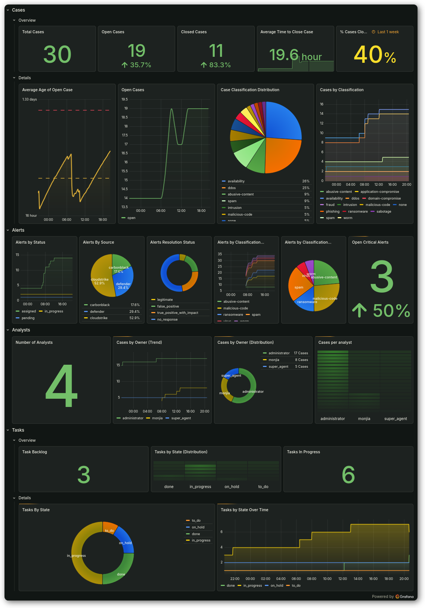

# DFIR-IRIS Exporter

*Dashboard Example*



> Example dashboards are stored in `./grafana/examples/...`  

## About

[DFIR-IRIS](https://www.dfir-iris.org/)

## Configuration

The exporter listens on port `10043` by default (reserved on the [Prometheus wiki](https://github.com/prometheus/prometheus/wiki/Default-port-allocations)).

```bash
# Copy and edit the template env file
cp template.env .env

# Source and run
set -a && source .env && set +a
./iris_exporter

# Or use docker
# Build and run
docker build -t iris_exporter -f build/Dockerfile .
docker run --env-file .env iris_exporter

# From registry 
docker run --env-file .env ghcr.io/monjiapawne/iris_exporter:latest
```

## Example metrics

```bash
# HELP iris_alerts_classification Alerts by classification
# TYPE iris_alerts_classification gauge
iris_alerts_classification{classification="abusive-content"} 8
iris_alerts_classification{classification="malicious-code"} 9
iris_alerts_classification{classification="ransomware"} 5
iris_alerts_classification{classification="spam"} 8
iris_alerts_classification{classification="virus"} 2
iris_alerts_classification{classification="worm"} 2
# HELP iris_alerts_resolution_status Alerts by resolution status
# TYPE iris_alerts_resolution_status gauge
iris_alerts_resolution_status{resolution_status="false_positive"} 3
iris_alerts_resolution_status{resolution_status="legitimate"} 1
iris_alerts_resolution_status{resolution_status="no_response"} 9
iris_alerts_resolution_status{resolution_status="true_positive_with_impact"} 4
# HELP iris_alerts_severity Alerts by severtiy
# TYPE iris_alerts_severity gauge
iris_alerts_severity{severity="critical"} 3
iris_alerts_severity{severity="high"} 1
iris_alerts_severity{severity="informational"} 1
iris_alerts_severity{severity="low"} 12
# HELP iris_alerts_source Alerts by source
# TYPE iris_alerts_source gauge
iris_alerts_source{source="carbonblack"} 3
iris_alerts_source{source="cloudstrike"} 9
iris_alerts_source{source="defender"} 5
# HELP iris_alerts_status Alerts by status
# TYPE iris_alerts_status gauge
iris_alerts_status{status="assigned"} 12
iris_alerts_status{status="closed"} 2
iris_alerts_status{status="in_progress"} 2
iris_alerts_status{status="pending"} 1
# HELP iris_alerts_total Alerts total
# TYPE iris_alerts_total gauge
iris_alerts_total 17
# HELP iris_cases_average_close_duration_days Average time to close case
# TYPE iris_cases_average_close_duration_days gauge
iris_cases_average_close_duration_days 0.8333333333333334
# HELP iris_cases_average_open_age_days Average age of all cases since open date
# TYPE iris_cases_average_open_age_days gauge
iris_cases_average_open_age_days 3.674278015106825
# HELP iris_cases_classification Cases by classification
# TYPE iris_cases_classification gauge
iris_cases_classification{classification="abusive-content"} 5
iris_cases_classification{classification="application-compromise"} 1
iris_cases_classification{classification="availability"} 15
iris_cases_classification{classification="ddos"} 14
iris_cases_classification{classification="domain-compromise"} 2
iris_cases_classification{classification="fraud"} 1
iris_cases_classification{classification="intrusion"} 3
iris_cases_classification{classification="malicious-code"} 3
iris_cases_classification{classification="none"} 3
iris_cases_classification{classification="phishing"} 1
iris_cases_classification{classification="ransomware"} 1
iris_cases_classification{classification="sabotage"} 1
iris_cases_classification{classification="spam"} 5
iris_cases_classification{classification="worm"} 2
# HELP iris_cases_current Current number of cases
# TYPE iris_cases_current gauge
iris_cases_current 30
# HELP iris_cases_owner Cases by owning user
# TYPE iris_cases_owner gauge
iris_cases_owner{owner="administrator"} 17
iris_cases_owner{owner="monjia"} 8
iris_cases_owner{owner="super_agent"} 5
# HELP iris_cases_state Cases per state.
# TYPE iris_cases_state gauge
iris_cases_state{state="closed"} 12
iris_cases_state{state="open"} 18
# HELP iris_tasks_state Tasks by state
# TYPE iris_tasks_state gauge
iris_tasks_state{state="done"} 3
iris_tasks_state{state="in_progress"} 6
iris_tasks_state{state="on_hold"} 2
iris_tasks_state{state="to_do"} 1
# HELP iris_users_by_account_type Users by account type
# TYPE iris_users_by_account_type gauge
iris_users_by_account_type{account_type="user"} 4
# HELP iris_users_status Users by state
# TYPE iris_users_status gauge
iris_users_status{status="active"} 4
```
